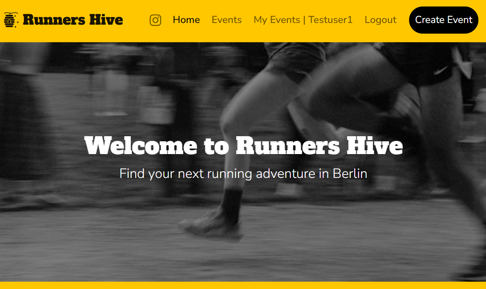
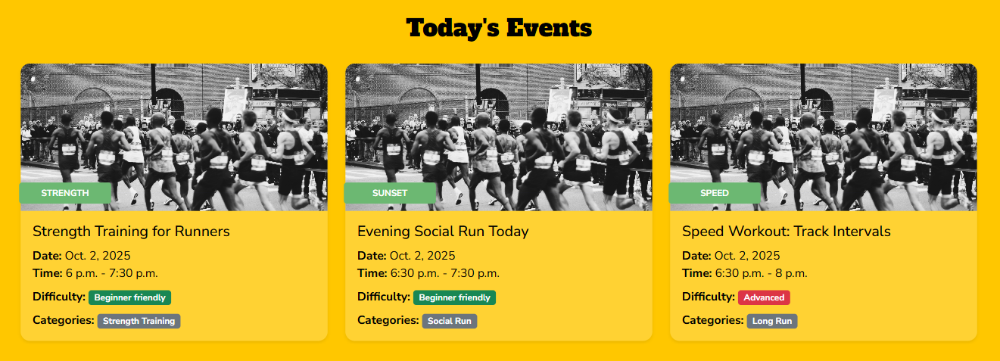
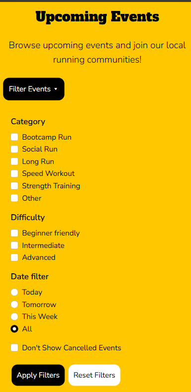
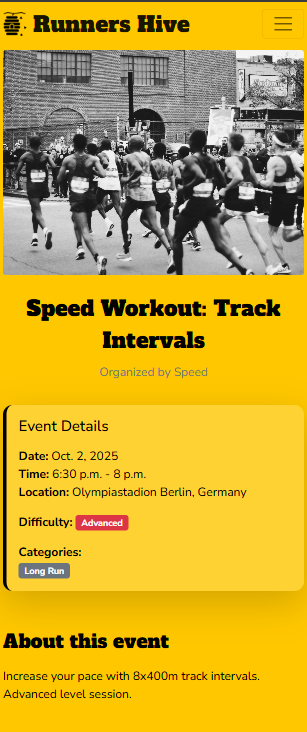
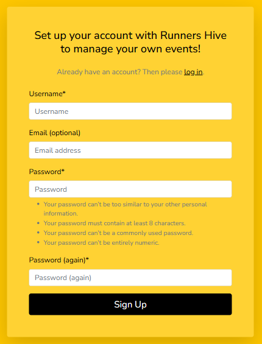
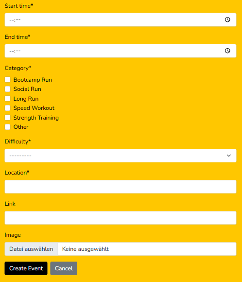
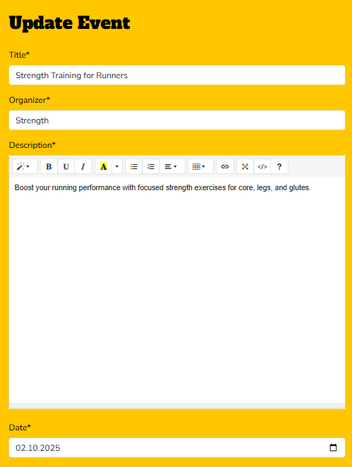
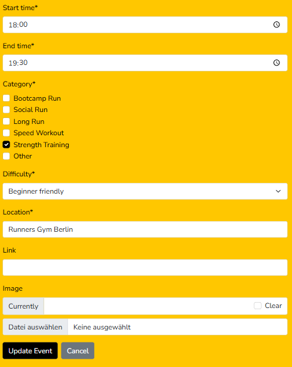

# Runners Hive

Developed by [kathrinmzl](https://www.github.com/kathrinmzl)

Runners Hive is a web-based platform designed to bring the running community in Berlin together. The platform allows event organizers to easily publish and promote their running events, while providing runners and visitors with a central place to discover new activities, join events, and connect with like-minded people. By centralizing all running events in one place, Runners Hive makes it simpler for both organizers and participants to engage with the vibrant running scene in Berlin.

The platform targets two main groups: community leaders who organize running events, and runners who are looking for new events to join. 

The idea for Runners Hive was inspired by the recent growth of run clubs and running events in Berlin. While the running scene has become increasingly vibrant, it is also fragmented across different websites, social media groups, and platforms, making it difficult for both organizers and participants to stay informed. I created this project to provide a unified platform that channels all these events, ensuring organizers have a dedicated space to promote their activities, and participants have a single point of access to discover and join them.

In essence, Runners Hive is intended to strengthen the local running community, simplify event promotion, and help more runners connect with the events they care about, fostering engagement, participation, and shared experiences.

The platform was created for educational purposes only.

[Live page on Heroku](https://runners-hive-6fdb552cead0.herokuapp.com/)

Source: [Runners Hive amiresponsive](https://ui.dev/amiresponsive?url=https://runners-hive-6fdb552cead0.herokuapp.com)

## UX

### The 5 Planes of UX

#### 1. Strategy

**Purpose**

- Provide running event organizers with a simple platform to publish, promote, and manage their events.
- Offer runners and visitors a central hub to discover upcoming events, filter them by interest or schedule, and connect with the Berlin running community.

**Primary User Needs**

- **Organizers** need tools to create, edit, and manage events, and keep their event information up to date.
- **Runners/Visitors** need a clear and intuitive way to browse events, filter them by date or category, and access detailed information about each event.
- **Guests** need to be able to explore the platform without registration, with the option to sign up if they want to publish events.

**Business Goals**

- Build a central platform that strengthens the Berlin running community by bringing events and participants together.
- Increase visibility for community organizers and help them reach a wider audience.
- Simplify event discovery for runners, reducing fragmentation across multiple platforms and sources.

#### 2. Scope

**[Features](#features)** (listed in detail below)

**Content Requirements**

- Event listings with essential details (title, date, time, location, category, description).
- Individual event pages with full event information.
- User account system for organizers (register, log in, log out).
- Event management tools for authenticated users (create, update, delete events).
- Profile page listing all events created by the logged-in user.
- Filter options for event discovery (e.g. by date range and category).
- Clear navigation structure for visitors and logged-in users.
- 404 error page for invalid routes.

#### 3. Structure

**Information Architecture**

- **Navigation Menu**:
    - Links to Home, Events, Login/Register, as well as Profile (My Events) and Logout (visible only when logged in).
- **Hierarchy**:
    - Today’s upcoming events are displayed prominently on the homepage.
    - A full list of events, including filter options, is positioned on the Events page.
    - Clear call-to-action buttons are provided for creating events (for logged-in users) and account creation (for guests).

**User Flow**

1. Guest users browse today’s featured events on the homepage → navigate to an event detail page for full descriptions.
2. Guest users visit the full Events page, use filters to browse → navigate to an event detail page.
3. Guests who want to publish events register for an account → log in to gain access to event creation.
4. Registered users create an event → the event appears immediately on the website.
5. Registered users access their Profile (My Events) page → edit, cancel, or delete their events.
6. Admin users access the Django admin panel → create or manage event categories (e.g., *Interval Session*).

#### 4. Skeleton

**[Wireframes](#wireframes)** (see below)

#### 5. Surface

**Visual Design Elements**
- **[Colours](#colour-scheme)** (see below)
- **[Typography](#typography)** (see below)

### Colour Scheme

I used [coolors.co](https://coolors.co/000000-ffc700-ffffff-eae8e2-6cb872-333333-1a1a1a) to generate my color palette.

- `#000000` secondary background, primary text
- `#FFC700` primary background
- `#FFFFFF` secondary text, light background (only buttons)
- `#EAE8E2` modal background
- `#6cb872` organizer badge background
- `#333333` accent color past events list
- `#1A1A1A` accent color past events list

- **Primary Colors:**
    - `#FFC700` – used as the primary background. This vibrant yellow ties into the theme of **Runners Hive**, inspired by the colors of bees, which are black and yellow.
    - `#000000` – used as the secondary background and primary text color. Black provides a strong contrast to yellow and helps maintain readability.
    - `#FFFFFF` – used for text on black backgrounds for clarity and accessibility.
- **Design Approach:**
    - The yellow color is already very eye-catching, so additional colors were kept minimal to avoid visual clutter.
    - All other colors are used sparingly for highlights, badges, or important indicators.
- **Bootstrap Colors:**
    - Additionally to the aforementioned colours, standard Bootstrap colors are used for buttons and badges:
        - `danger` – e.g., for "Cancelled" badges or delete/logout buttons.
        - `secondary`, `success`, `warning` – used contextually for status indicators, difficulty levels, or informative highlights.

This consistent color scheme ensures that Runners Hive is visually engaging while maintaining clear usability and readability throughout the platform.

### Typography

- [Alfa Slab One](https://fonts.google.com/specimen/Alfa+Slab+One) was used for the primary headers and titles to create a bold, distinctive look that draws attention and reinforces the energetic, dynamic theme of Runners Hive.
- [Nunito Sans](https://fonts.google.com/specimen/Nunito+Sans) was used for all other secondary text because it is highly readable and works well for longer content, providing a clean and modern appearance.
- [Font Awesome](https://fontawesome.com) icons were used throughout the site, such as the social media icon in the navbar and the GitHub icon in the footer, to provide clear visual cues and improve user navigation.

## Wireframes

To follow best practice, wireframes were developed for mobile and tablet/desktop sizes.
I've used [Balsamiq](https://balsamiq.com/wireframes) to design my site wireframes.

I did not create wireframes for the Logout page because its design was straightforward and did not require detailed planning. Additionally, wireframes were not made for the error pages (404, 403, 500).

The final website includes some deviations from the original wireframes. These changes were made during development to improve the overall user experience based on practical insights.

| Page | Mobile | Tablet/Desktop |
| --- | --- | --- |
| Home |  |  |
| Events List |  |  |
| Create Event |  |  |
| Profile |  |  |
| Event Details |  |  |
| Register |  |  |
| Login |  |  |

## User Stories

In addition to the user stories shown here that are implemented in the current version of the website, several other user stories were developed during the initial planning phase but have not yet been implemented. These will be considered as **[future features](#future-features)** for upcoming releases.

| Nr | Target | Expectation | Outcome |
| --- | --- | --- | --- |
| 1.1 | As a runner | I can see a list of upcoming events | so that I can find runs to join. |
| 1.2 | As a runner | I can filter events by date (Today, This Week, This Month) | so that I can quickly find ones that fit my schedule. |
| 1.3 | As a runner | I can filter events by category | so that I can find the type of event I prefer. |
| 1.4 | As a runner | I can filter events by difficulty | so that I can find the type of event I prefer. |
| 1.5 | As a runner | I can view details of a specific event | so that I can decide whether I want to participate. |
| 2.1 | As a logged-in user | I can not edit or delete another user’s events | so that data integrity is maintained. |
| 2.2 | As an organizer | I can create a new event | so that runners can find it. |
| 2.3 | As an organizer | I can edit my event | so that I can update details. |
| 2.4 | As an organizer | I can delete my event | so that I can remove it  if I don't want to publish it anymore. |
| 2.5 | As an organizer | I cannot edit past events | so that historical data is preserved. |
| 2.6 | As an organizer | I can cancel my event | so that I can tell visitors that the event is not happening anymore. |
| 3.1 | As a logged-in user | I can view my profile page | so that I can see the events I’ve added. |
| 3.2 | As a logged-in user | I can update or delete my events from my profile | so that I can manage them easily. |
| 4.1 | As a new user | I can register for an account | so that I can add and manage my own events. |
| 4.2 | As a user | I can log in and log out | so that I can access my profile and event management. |
| 4.3 | As a visitor | I can use clear and simple navigation | so that I can find events, login, or register. |
| 4.4 | As a developer | I can test the app thoroughly | so that I can deploy it with confidence. |

## Features

⚠️ INSTRUCTIONS ⚠️

In this section, you should go over the different parts of your project, and describe each feature. You should explain what value each of the features provides for the user, focusing on your target audience, what they want to achieve, and how your project can help them achieve these things.

**IMPORTANT**: Remember to always include a screenshot of each individual feature!

⚠️ --- END --- ⚠️

### Existing Features

| Feature | Notes | Screenshot |
| --- | --- | --- |
| Navigation | A responsive navigation bar allows users to quickly move between homepage, events list, login/logout and profile pages. It also includes a Font Awesome Instagram icon linking to the Runners Hive social media account. For logged-in users it shows the profile page (My Events) and the option to logout, users that are not logged in, see the option to login instead. On mobile screens the navbar opens via a hamburger menu.| Logged in (Mobile and Tablet/Desktop):   Not logged in (Mobile and Tablet/Desktop):  |
| Hero Section | The homepage features a prominent hero image with a clear message explaining the purpose of the platform, instantly engaging visitors. |  |
| Today's Events | The start page automatically displays today's upcoming events, making it effortless for users to quickly find something they can join *right now* — for example, after work or on short notice. A notification text is shown, if there are no more events coming up today.| Mobile:  Tablet/Desktop:  No upcoming events today: |
| Call to Action | Strategically placed **“Create Event”** and **"Browse All Events”** buttons encourage user participation. One "Create Event" button is placed in the navigation bar for quick access, while the homepage additionally features a dedicated section that encourages visitors to share their own running events. This section also includes a prominent call-to-action button to further boost engagement. Additionally, beneath the today's events list, a prominent “Browse All Events” button allows users to seamlessly continue browsing the full event catalogue if they want to explore further.  | Create Event Button Navbar:  Share your event section (Mobile and Tablet/Desktop):   Browse all events button:  |
| Events Page | Shows all upcoming events while automatically filtering out past ones. This provides users with a clear overview of all available events, making it easy to discover new runs and plan their participation in the local running community. | Mobile and Tablet/Desktop:  |
| Event Filters | On the events page users can filter events by date (Today / This Week / This Month), category (e.g. Social Run, Trail Run), difficulty (Beginner-Friendly / Intermediate / Advanced), and hide cancelled events. Filtering events helps the visitor to quickly find events that fit their schedule and match their interestes.   The filter section opens by clicking on the "Filter Events" button. | Button:   Mobile and Tablet/Desktop:  |
| Event Details | Clicking on any event card opens a dedicated event page. The page displays the event image at the top, followed by the organizer information. Event details and the description are shown side by side on larger screens or stacked on smaller screens, with the most important details (date, time, location, difficulty) highlighted in a card to make them stand out. This allows users to quickly access all essential information about an event in a clear and organized layout, helping them decide whether to participate. | Mobile and Tablet/Desktop:    |
| Register | New users can create an account in order to publish and manage events. |  |
| Login | Returning users can securely log in to access event management features. |  |
| Logout | Logged-in users can log out from their session at any time. They have to confirm their decision before being logged out. |  |
| Create Event | Logged-in users can publish events by entering a title, date, time, location, category, description, selecting difficulty level, and optionally adding an image or link. The description field uses the Summernote rich text editor, allowing users to format text, create lists, and style their content for better readability and presentation.   Users who are not logged in are automatically redirected to the **Login** page when attempting to create an event, ensuring a smooth conversion into registered contributors. This feature empowers community leaders to easily share events and engage runners. |   |
| Profile (My Events) | Logged-in users can view all their own events, grouped by upcoming and past, and can edit, cancel, or delete them directly from this page. For future events, the edit, cancel, and delete buttons are conveniently shown in the footer of the event cards. This gives users a central location to manage their events efficiently and stay on top of their contributions to the community. | Upcoming events:  Past events:   |
| Edit Event | Event owners can edit their future events using a form, prefilled with the existing event information. This allows organizers to update details for their events. |   |
| Cancel Event | Event owners can mark future events as *Cancelled*, displaying a visible badge instead of removing them entirely. This prevents confusion for users who may have already planned to participate, as the event remains visible but clearly marked as inactive. Cancelled events can also be easily un-cancelled if plans change again. |  |
| Delete Event | Events — whether upcoming or past — can be permanently deleted by their owners. This allows users to clean up their profile or remove outdated entries entirely. A confirmation prompt ensures events are not deleted by accident. |  |
| Pagination | Pagination is available for all event lists that display upcoming events using cards, including today’s events on the homepage, the full Events page, and upcoming events on the user’s Profile page. If there are more than two pages, numbered page buttons are displayed in addition to "Prev" and "Next" buttons, making it easy for users to navigate directly to a specific page. This improves navigation and prevents users from being overwhelmed by long lists. |  |
| Admin Panel – Category Management | Admins can manage event categories by adding new ones or removing outdated options. They can also define the display order to control how categories appear in the filtering options across the site. |  |
| Admin Panel – Event Management | Admin users can access all events on the platform and have full control to create, update, or delete any event. This complements the category management functionality, giving admins comprehensive oversight of the platform’s content and ensuring smooth operation. |  |
| User Feedback | Clear messages provide feedback for actions like logging in, creating, editing, cancelling, or deleting events. Bootstrap toasts display these notifications: success toasts disappear automatically after 3 seconds, while info and error toasts must be dismissed manually. Form validation errors during event creation or editing are shown directly within the form for instant guidance. | Toast message:  Form validation errors:  |
| Responsive Design | All pages are optimized for mobile, tablet and desktop for runners on the go. | Please refer to other screenshots in this section that show the differences between mobile and tablet or desktop screens. |
| Footer | The footer provides site-wide information and links. It displays copyright information, the developer’s name, and a link to the project’s GitHub page, represented with a Font Awesome icon for easy recognition. | Mobile and Tablet/Desktop:    |
| Custom 403, 404 & 500 Pages | Instead of generic server responses, styled error pages guide users when they access restricted content (403), non-existent pages (404), or when an internal error occurs (500). | e.g. 404 Page: |

