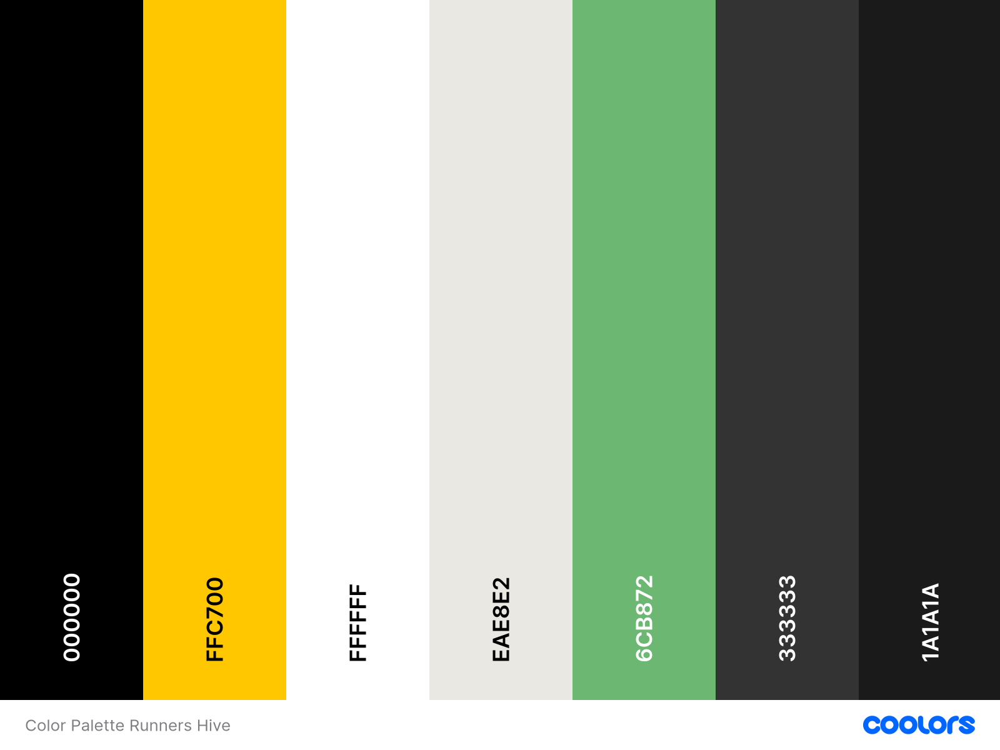
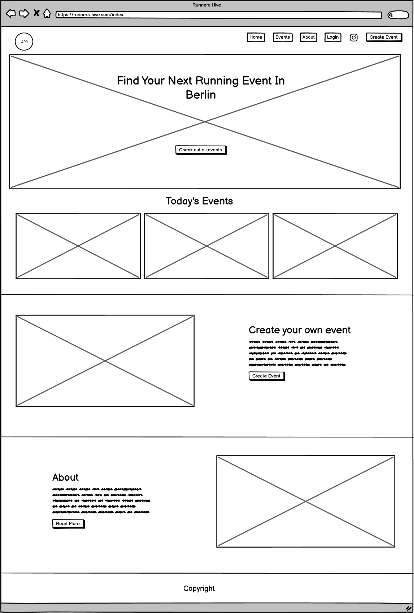
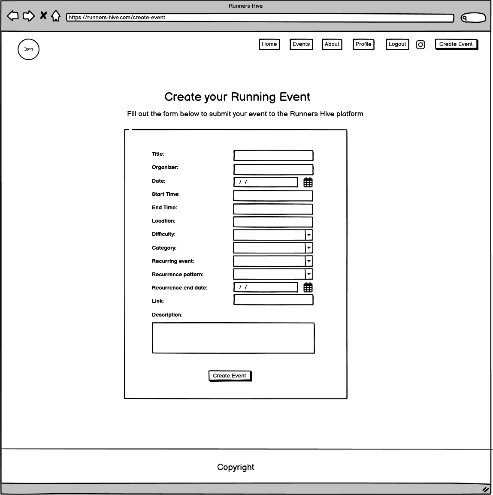
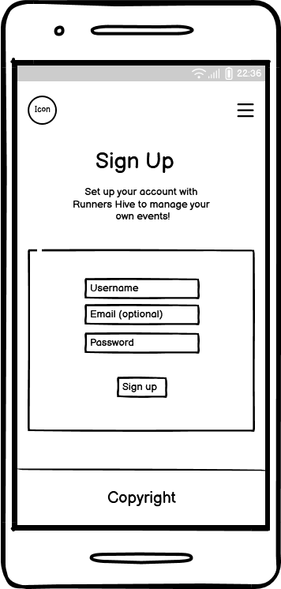
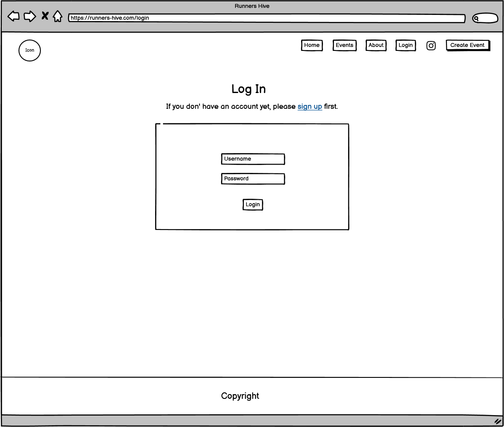

# Runners Hive

Developer: [kathrinmzl](https://www.github.com/kathrinmzl)

Runners Hive is a web-based platform designed to bring the running community in Berlin together. The platform allows event organizers to easily publish and promote their running events, while providing runners and visitors with a central place to discover new activities, join events, and connect with like-minded people. By centralizing all running events in one place, Runners Hive makes it simpler for both organizers and participants to engage with the vibrant running scene in Berlin.

The platform targets two main groups: community leaders who organize running events, and runners who are looking for new events to join. 

The idea for Runners Hive was inspired by the recent growth of run clubs and running events in Berlin. While the running scene has become increasingly vibrant, it is also fragmented across different websites, social media groups, and platforms, making it difficult for both organizers and participants to stay informed. I created this project to provide a unified platform that channels all these events, ensuring organizers have a dedicated space to promote their activities, and participants have a single point of access to discover and join them.

In essence, Runners Hive is intended to strengthen the local running community, simplify event promotion, and help more runners connect with the events they care about, fostering engagement, participation, and shared experiences.

The platform was created for educational purposes only.

[Live page on Heroku](https://runners-hive-6fdb552cead0.herokuapp.com/)

source: [Runners Hive amiresponsive](https://ui.dev/amiresponsive?url=https://runners-hive-6fdb552cead0.herokuapp.com)

## UX

### The 5 Planes of UX

#### 1. Strategy

**Purpose**

- Provide running event organizers with a simple platform to publish, promote, and manage their events.
- Offer runners and visitors a central hub to discover upcoming events, filter them by interest or schedule, and connect with the Berlin running community.

**Primary User Needs**

- **Organizers** need tools to create, edit, and manage events, and keep their event information up to date.
- **Runners/Visitors** need a clear and intuitive way to browse events, filter them by date or category, and access detailed information about each event.
- **Guests** need to be able to explore the platform without registration, with the option to sign up if they want to publish events.

**Business Goals**

- Build a central platform that strengthens the Berlin running community by bringing events and participants together.
- Increase visibility for community organizers and help them reach a wider audience.
- Simplify event discovery for runners, reducing fragmentation across multiple platforms and sources.

#### 2. Scope

**[Features](#features)** (listed in detail below)

**Content Requirements**

- Event listings with essential details (title, date, time, location, category, description).
- Individual event pages with full event information.
- User account system for organizers (register, log in, log out).
- Event management tools for authenticated users (create, update, delete events).
- Profile page listing all events created by the logged-in user.
- Filter options for event discovery (e.g. by date range and category).
- Clear navigation structure for visitors and logged-in users.
- 404 error page for invalid routes.

#### 3. Structure

**Information Architecture**

- **Navigation Menu**:
    - Links to Home, Events, Login/Register, as well as Profile (My Events) and Logout (visible only when logged in).
- **Hierarchy**:
    - Today’s upcoming events are displayed prominently on the homepage.
    - A full list of events, including filter options, is positioned on the Events page.
    - Clear call-to-action buttons are provided for creating events (for logged-in users) and account creation (for guests).

**User Flow**

1. Guest users browse today’s featured events on the homepage → navigate to an event detail page for full descriptions.
2. Guest users visit the full Events page, use filters to browse → navigate to an event detail page.
3. Guests who want to publish events register for an account → log in to gain access to event creation.
4. Registered users create an event → the event appears immediately on the website.
5. Registered users access their Profile (My Events) page → edit, cancel, or delete their events.
6. Admin users access the Django admin panel → create or manage event categories (e.g., *Interval Session*).

#### 4. Skeleton

**[Wireframes](#wireframes)** (see below)

#### 5. Surface

**Visual Design Elements**
- **[Colours](#colour-scheme)** (see below)
- **[Typography](#typography)** (see below)

### Colour Scheme

I used [coolors.co](https://coolors.co/000000-ffc700-ffffff-eae8e2-6cb872-333333-1a1a1a) to generate my color palette.

- `#000000` secondary background, primary text
- `#FFC700` primary background
- `#FFFFFF` secondary text, light background (only buttons)
- `#EAE8E2` modal background
- `#6cb872` organizer badge background
- `#333333` accent color past events list
- `#1A1A1A` accent color past events list

- **Primary Colors:**
    - `#FFC700` – used as the primary background. This vibrant yellow ties into the theme of **Runners Hive**, inspired by the colors of bees, which are black and yellow.
    - `#000000` – used as the secondary background and primary text color. Black provides a strong contrast to yellow and helps maintain readability.
    - `#FFFFFF` – used for text on black backgrounds for clarity and accessibility.
- **Design Approach:**
    - The yellow color is already very eye-catching, so additional colors were kept minimal to avoid visual clutter.
    - All other colors are used sparingly for highlights, badges, or important indicators.
- **Bootstrap Colors:**
    - Additionally to the aforementioned colours, standard Bootstrap colors are used for buttons and badges:
        - `danger` – e.g., for "Cancelled" badges or delete/logout buttons.
        - `secondary`, `success`, `warning` – used contextually for status indicators, difficulty levels, or informative highlights.

This consistent color scheme ensures that Runners Hive is visually engaging while maintaining clear usability and readability throughout the platform.

### Typography

- [Alfa Slab One](https://fonts.google.com/specimen/Alfa+Slab+One) was used for the primary headers and titles to create a bold, distinctive look that draws attention and reinforces the energetic, dynamic theme of Runners Hive.
- [Nunito Sans](https://fonts.google.com/specimen/Nunito+Sans) was used for all other secondary text because it is highly readable and works well for longer content, providing a clean and modern appearance.
- [Font Awesome](https://fontawesome.com) icons were used throughout the site, such as the social media icon in the navbar and the GitHub icon in the footer, to provide clear visual cues and improve user navigation.

## Wireframes

To follow best practice, wireframes were developed for mobile and tablet/desktop sizes.
I've used [Balsamiq](https://balsamiq.com/wireframes) to design my site wireframes.

I did not create wireframes for the Logout page because its design was straightforward and did not require detailed planning. Additionally, wireframes were not made for the error pages (404, 403, 500).

The final website includes some deviations from the original wireframes. These changes were made during development to improve the overall user experience based on practical insights.

| Page | Mobile | Tablet/Desktop |
| --- | --- | --- |
| Home |  |  |
| Events List |  |  |
| Create Event |  |  |
| Profile |  |  |
| Event Details |  |  |
| Register |  |  |
| Login |  |  |

## User Stories

| Nr | Target | Expectation | Outcome |
| --- | --- | --- | --- |
| 1.1 | As a runner | I can see a list of upcoming events | so that I can find runs to join. |
| 1.2 | As a runner | I can filter events by date (Today, This Week, This Month) | so that I can quickly find ones that fit my schedule. |
| 1.3 | As a runner | I can filter events by category | so that I can find the type of event I prefer. |
| 1.4 | As a runner | I can filter events by difficulty | so that I can find the type of event I prefer. |
| 1.5 | As a runner | I can view details of a specific event | so that I can decide whether I want to participate. |
| 2.1 | As a logged-in user | I can not edit or delete another user’s events | so that data integrity is maintained. |
| 2.2 | As an organizer | I can create a new event | so that runners can find it. |
| 2.3 | As an organizer | I can edit my event | so that I can update details. |
| 2.4 | As an organizer | I can delete my event | so that I can remove it  if I don't want to publish it anymore. |
| 2.5 | As an organizer | I cannot edit past events | so that historical data is preserved. |
| 2.6 | As an organizer | I can cancel my event | so that I can tell visitors that the event is not happening anymore. |
| 3.1 | As a logged-in user | I can view my profile page | so that I can see the events I’ve added. |
| 3.2 | As a logged-in user | I can update or delete my events from my profile | so that I can manage them easily. |
| 4.1 | As a new user | I can register for an account | so that I can add and manage my own events. |
| 4.2 | As a user | I can log in and log out | so that I can access my profile and event management. |
| 4.3 | As a visitor | I can use clear and simple navigation | so that I can find events, login, or register. |
| 4.4 | As a developer | I can test the app thoroughly | so that I can deploy it with confidence. |

In addition to the user stories shown here that are implemented in the current version of the website, several other user stories were developed during the initial planning phase but have not yet been implemented. These will be considered as **[future features](#future-features)** for upcoming releases.
