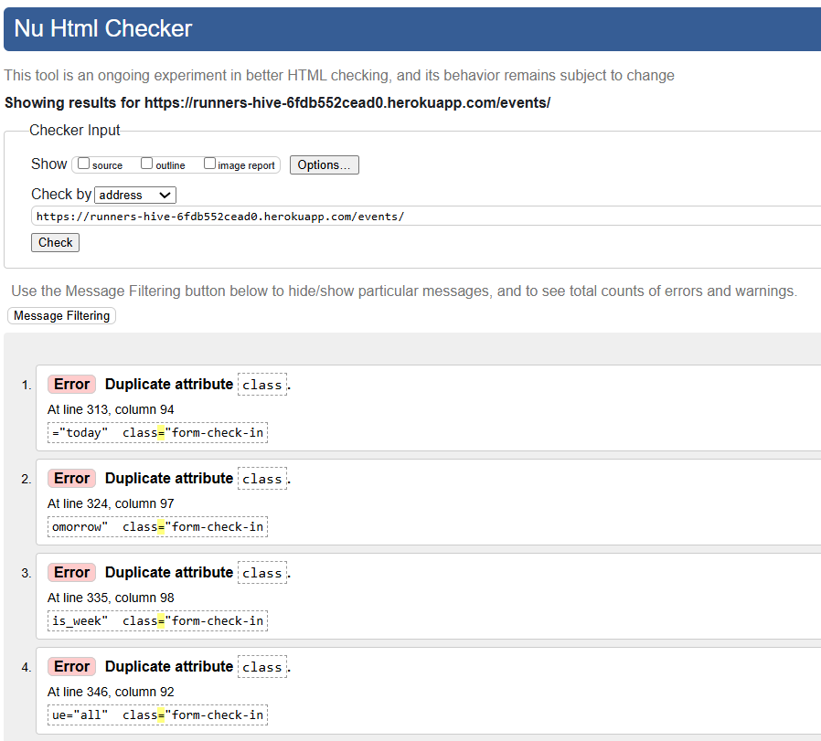
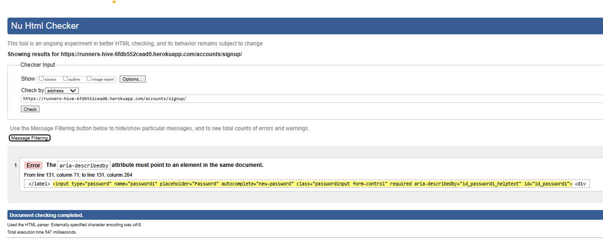
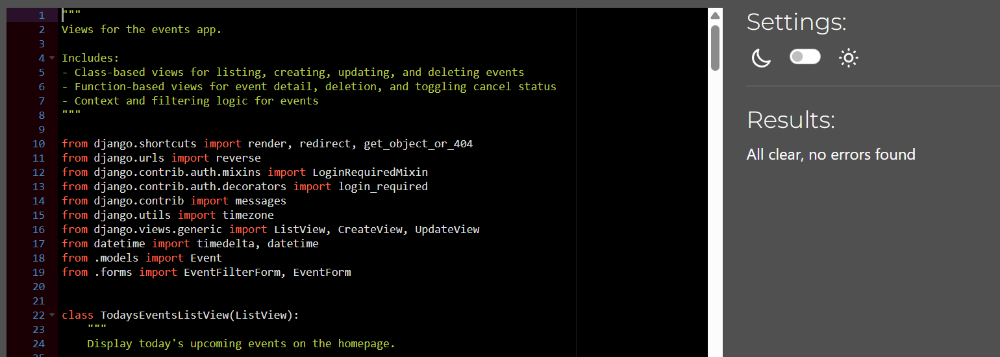

# Testing

> [!NOTE]  
> Return back to the [README.md](README.md) file.

## Code Validation

⚠️ INSTRUCTIONS ⚠️

Use the space below to discuss code validation for all of your own code files (*where applicable*). You are not required to validate external libraries/frameworks.

**MANDATORY**: You must provide a screenshot for each file you validate.

**PRO TIP**: Where possible, always validate the live URL pages/files, not your local code using copy/paste. There could be subtle/hidden differences.

⚠️ --- END --- ⚠️

### HTML

⚠️ INSTRUCTIONS ⚠️

1. [*recommended*] If you are using the live deployed site URLs, validate using this link: https://validator.w3.org/#validate_by_uri
2. Otherwise, if you are copying/pasting your HTML code manually, use this link: https://validator.w3.org/#validate_by_input

It's recommended to validate the live pages (all of them) using the deployed URL. This will give you a custom URL as well, which you can use below on your testing documentation. It makes it easier to return back to a page for validating it again in the future. The URL will look something like this:

- https://validator.w3.org/nu/?doc=https://kathrinmzl.github.io/RunnersHive/index.html

⚠️ --- END --- ⚠️

🛑 IMPORTANT 🛑

RE: Python/Jinja syntax in HTML

Python projects that use Jinja syntax, such as ``, ``, and `{{ variable|filter }}` will not validate properly if you're copying/pasting into the HTML validator.

In order to properly validate these types of files, it's recommended to [validate by uri](https://validator.w3.org/#validate_by_uri) from the deployed Heroku pages.

Unfortunately, pages that require a user to be "logged-in" and authenticated (CRUD functionality) will not work using this method, due to the fact that the HTML Validator (W3C) doesn't have access to login to an account on your project. In order to properly validate HTML pages with Jinja syntax for authenticated pages, follow these steps:

- Navigate to the deployed pages which require authentication.
- Right-click anywhere on the page, and select **View Page Source** (usually `CTRL+U` or `⌘+U` on Mac).
- This will display the entire "compiled" code, without any Jinja syntax.
- Copy everything, and use the [validate by input](https://validator.w3.org/#validate_by_input) method.
- Repeat this process for every page that requires a user to be logged-in/authenticated (e.g.: CRUD functionality).

🛑 ---- END --- 🛑

I have used the recommended [HTML W3C Validator](https://validator.w3.org) to validate all of my HTML files.

When I validated the first full version of the website I got the following warning messages for all my html files. This is because the affected code was inside my base.html file, which cannot be validated seperately, but is part of all sites on the deployed website.

I documented how I solved the warning messages in [GitHub Issues](https://github.com/kathrinmzl/RunnersHive/issues/24). 
There I also tracked all remaining errors/warning messages. The links to the respective issue on GitHub can be found in the following table under "Initial result", if applicable.

The HTML files *"_event_card.html"* and *"_page_navigation.html"* were not seperately tested because they are called within the index, events-list and profile pages. I made sure to have enough events available in my dataset to trigger the pagination buttons, so that they would be present in the validated HTML code.

The final version of the website shows no further HTML Validation issues.

| Directory | File | URL | Final result | Initial result |
| --- | --- | --- | --- | --- |
| events/templates/events | [event_detail.html](https://github.com/kathrinmzl/RunnersHive/blob/main/events/templates/events/event_detail.html) |   | No Errors  | [Issue Link](https://github.com/kathrinmzl/RunnersHive/issues/26)   |
| events/templates/events | [event_form.html](https://github.com/kathrinmzl/RunnersHive/blob/main/events/templates/events/event_form.html) |   | No Errors  | - |
| events/templates/events | [event_list.html](https://github.com/kathrinmzl/RunnersHive/blob/main/events/templates/events/event_list.html) | [W3C Link](https://validator.w3.org/nu/?doc=https://runners-hive-6fdb552cead0.herokuapp.com/events/&out=html) | No Errors  | [Issue Link](https://github.com/kathrinmzl/RunnersHive/issues/25)  |
| events/templates/events | [profile.html](https://github.com/kathrinmzl/RunnersHive/blob/main/events/templates/events/profile.html) |   | No Errors  | - |
| runnershive/templates | [403.html](https://github.com/kathrinmzl/RunnersHive/blob/main/templates/403.html) |   | No Errors  | - |
| runnershive/templates | [404.html](https://github.com/kathrinmzl/RunnersHive/blob/main/templates/404.html) |   | No Errors  | -  |
| runnershive/templates | [500.html](https://github.com/kathrinmzl/RunnersHive/blob/main/templates/500.html) |   | No Errors  | -  |
| runnershive/templates | [index.html](https://github.com/kathrinmzl/RunnersHive/blob/main/templates/index.html) | [W3C Link](https://validator.w3.org/nu/?doc=https://runners-hive-6fdb552cead0.herokuapp.com/&out=html) | No Errors  | - |
| runnershive/templates/account | [login.html](https://github.com/kathrinmzl/RunnersHive/blob/main/templates/account/login.html) | [W3C Link](https://validator.w3.org/nu/?doc=https://runners-hive-6fdb552cead0.herokuapp.com/accounts/login/&out=html) | No Errors  | - |
| runnershive/templates/account | [logout.html](https://github.com/kathrinmzl/RunnersHive/blob/main/templates/account/logout.html) |   | No Errors  | -  |
| runnershive/templates/account | [signup.html](https://github.com/kathrinmzl/RunnersHive/blob/main/templates/account/signup.html) |[W3C Link](https://validator.w3.org/nu/?doc=https%3A%2F%2Frunners-hive-6fdb552cead0.herokuapp.com%2Faccounts%2Fsignup%2F) | No Errors  | [Issue Link](https://github.com/kathrinmzl/RunnersHive/issues/27)  |

All other html files under *runnershive/templates/account* were created using `allauth` and have not been altered by me.

### CSS

I have used the recommended [CSS Jigsaw Validator](https://jigsaw.w3.org/css-validator) to validate all of my CSS files.

| Directory | File | URL | Screenshot | Notes |
| --- | --- | --- | --- | --- |
| static | [style.css](https://github.com/kathrinmzl/RunnersHive/blob/main/static/css/style.css) | [W3C Link](https://jigsaw.w3.org/css-validator/validator?uri=https://runners-hive-6fdb552cead0.herokuapp.com) |  | No Errors |

### JavaScript

I have used the recommended [JShint Validator](https://jshint.com) to validate all of my JS files.

| Directory | File | URL | Screenshot | Notes |
| --- | --- | --- | --- | --- |
| static | [profile.js](https://github.com/kathrinmzl/RunnersHive/blob/main/static/js/profile.js) |  |  | No Errors |
| static | [toasts.js](https://github.com/kathrinmzl/RunnersHive/blob/main/static/js/toasts.js) |  |  | Undefined variable 'Bootstrap' is acceptable because it's imported locally|
| static | [date_limit.js](https://github.com/kathrinmzl/RunnersHive/blob/main/static/js/date_limit.js) |  |  | No Errors |

### Python

I have used the recommended [PEP8 CI Python Linter](https://pep8ci.herokuapp.com) to validate all of my Python files.

| Directory | File | URL | Screenshot | Notes |
| --- | --- | --- | --- | --- |
| events | [admin.py](https://github.com/kathrinmzl/RunnersHive/blob/main/events/admin.py) | [PEP8 CI Link](https://pep8ci.herokuapp.com/https://raw.githubusercontent.com/kathrinmzl/RunnersHive/main/events/admin.py) |  | No Errors |
| events | [forms.py](https://github.com/kathrinmzl/RunnersHive/blob/main/events/forms.py) | [PEP8 CI Link](https://pep8ci.herokuapp.com/https://raw.githubusercontent.com/kathrinmzl/RunnersHive/main/events/forms.py) |  | No Errors |
| events | [models.py](https://github.com/kathrinmzl/RunnersHive/blob/main/events/models.py) | [PEP8 CI Link](https://pep8ci.herokuapp.com/https://raw.githubusercontent.com/kathrinmzl/RunnersHive/main/events/models.py) |  | No Errors |
| events | [tests.py](https://github.com/kathrinmzl/RunnersHive/blob/main/events/tests.py) | [PEP8 CI Link](https://pep8ci.herokuapp.com/https://raw.githubusercontent.com/kathrinmzl/RunnersHive/main/events/tests.py) |  | No Errors |
| events | [urls.py](https://github.com/kathrinmzl/RunnersHive/blob/main/events/urls.py) | [PEP8 CI Link](https://pep8ci.herokuapp.com/https://raw.githubusercontent.com/kathrinmzl/RunnersHive/main/events/urls.py) |  | No Errors |
| events | [views.py](https://github.com/kathrinmzl/RunnersHive/blob/main/events/views.py) | [PEP8 CI Link](https://pep8ci.herokuapp.com/https://raw.githubusercontent.com/kathrinmzl/RunnersHive/main/events/views.py) |  | No Errors |
| runnershive | [settings.py](https://github.com/kathrinmzl/RunnersHive/blob/main/runnershive/settings.py) | [PEP8 CI Link](https://pep8ci.herokuapp.com/https://raw.githubusercontent.com/kathrinmzl/RunnersHive/main/runnershive/settings.py) |  | No Errors |
| runnershive | [urls.py](https://github.com/kathrinmzl/RunnersHive/blob/main/runnershive/urls.py) | [PEP8 CI Link](https://pep8ci.herokuapp.com/https://raw.githubusercontent.com/kathrinmzl/RunnersHive/main/runnershive/urls.py) |  | No Errors |
|  | [manage.py](https://github.com/kathrinmzl/RunnersHive/blob/main/manage.py) | [PEP8 CI Link](https://pep8ci.herokuapp.com/https://raw.githubusercontent.com/kathrinmzl/RunnersHive/main/manage.py) |  | No Errors |

## Responsiveness

⚠️ INSTRUCTIONS ⚠️

Use this space to discuss testing the live/deployed site on various device sizes.

The minimum requirement is to test the following 3 sizes:

- Mobile
- Tablet
- Desktop

**IMPORTANT**: You must provide screenshots of your results, to "prove" that you've actually tested them.

Using the [amiresponsive](http://ami.responsivedesign.is) mockup images (*or similar*) does not meet the requirements. Consider using some of the built-in device sizes from the Developer Tools.

If you have tested the project on your actual mobile phone or tablet, consider also including screenshots of these as well. It showcases a higher level of manual tests, and can be seen as a positive inclusion!

⚠️ --- END --- ⚠️

I've tested my deployed project to check for responsiveness issues.

| Page | Mobile | Tablet | Desktop | Notes |
| --- | --- | --- | --- | --- |
| Register |  |  |  | Works as expected |
| Login |  |  |  | Works as expected |
| Home |  |  |  | Works as expected |
| Add Blog |  |  |  | Works as expected |
| Edit Blog |  |  |  | Works as expected |
| Blog Post |  |  |  | Works as expected |
| 404 |  |  |  | Works as expected |

## Browser Compatibility

⚠️ INSTRUCTIONS ⚠️

Use this space to discuss testing the live/deployed site on various browsers. Consider testing at least 3 different browsers, if available on your system. You DO NOT need to use all of the browsers below, just pick any 3 (minimum).

Recommended browsers to consider:
- [Chrome](https://www.google.com/chrome)
- [Firefox (Developer Edition)](https://www.mozilla.org/firefox/developer)
- [Edge](https://www.microsoft.com/edge)
- [Safari](https://support.apple.com/downloads/safari)
- [Brave](https://brave.com/download)
- [Opera](https://www.opera.com/download)

**IMPORTANT**: You must provide screenshots of the browsers you've tested, to "prove" that you've actually tested them.

Please note, there are services out there that can test multiple browser compatibilities at the same time. Some of these are paid services, but some are free. If you use these, you must provide a link to the source used for attribution, and multiple screenshots of the results.

⚠️ --- END --- ⚠️

I've tested my deployed project on multiple browsers to check for compatibility issues.

| Page | Chrome | Firefox | Safari | Notes |
| --- | --- | --- | --- | --- |
| Register |  |  |  | Works as expected |
| Login |  |  |  | Works as expected |
| Home |  |  |  | Works as expected |
| Add Blog |  |  |  | Works as expected |
| Edit Blog |  |  |  | Works as expected |
| Blog Post |  |  |  | Works as expected |
| 404 |  |  |  | Works as expected |

## Lighthouse Audit

I've tested my deployed project using the Lighthouse Audit tool to check for any major issues. Some warnings are outside of my control, and mobile results tend to be lower than desktop.

| Page | Mobile | Desktop |
| --- | --- | --- |
| Homepage |  |  |
| Events |  |  |
| Event Details |  |  |
| Profile |  |  |
| Create Event |  |  |
| Login |  |  |
| Signup |  |  |
| Logout |  |  |
| 404 |  |  |

## Defensive Programming

⚠️ INSTRUCTIONS ⚠️

Defensive programming (defensive design) is extremely important! When building projects that accept user inputs or forms, you should always test the level of security for each form field. Examples of this could include (but not limited to):

All Projects:

- Users cannot submit an empty form (add the `required` attribute)
- Users must enter valid field types (ensure the correct input `type=""` is used)
- Users cannot brute-force a URL to navigate to a restricted pages

Python Projects:

- Users cannot perform CRUD functionality if not authenticated (if login functionality exists)
- User-A should not be able to manipulate data belonging to User-B, or vice versa
- Non-Authenticated users should not be able to access pages that require authentication
- Standard users should not be able to access pages intended for superusers/admins

You'll want to test all functionality on your application, whether it's a standard form, or CRUD functionality, for data manipulation on a database. Try to access various pages on your site as different user types (User-A, User-B, guest user, admin, superuser). You should include any manual tests performed, and the expected results/outcome.

Testing should be replicable (can someone else replicate the same outcome?). Ideally, tests cases should focus on each individual section of every page on the website. Each test case should be specific, objective, and step-wise replicable.

Instead of adding a general overview saying that everything works fine, consider documenting tests on each element of the page (eg. button clicks, input box validation, navigation links, etc.) by testing them in their "happy flow", their "bad/exception flow", mentioning the expected and observed results, and drawing a parallel between them where applicable.

Consider using the following format for manual test cases:

- Expected Outcome / Test Performed / Result Received / Fixes Implemented

- **Expected**: "Feature is expected to do X when the user does Y."
- **Testing**: "Tested the feature by doing Y."
- (either) **Result**: "The feature behaved as expected, and it did Y."
- (or) **Result**: "The feature did not respond to A, B, or C."
- **Fix**: "I did Z to the code because something was missing."

Use the table below as a basic start, and expand on it using the logic above.

⚠️ --- END --- ⚠️

Defensive programming was manually tested with the below user acceptance testing:

| Page / Feature | Expectation | Test | Result | Screenshot |
| --- | --- | --- | --- | --- |
| Event Creation (Authenticated Users Only) | Only logged-in users can access the event creation form. | Tried to access `/events/create/` as a guest user. | Redirected to login page as expected. | <video width="320" height="240" controls><source src="docs/testing/defensive_programming/create-event-guest.mp4" type="video/mp4">Your browser does not support the video tag.</video> |
| | Valid event form submissions should save successfully. | Created an event with valid input fields. | Event was successfully created and visible on events list. | <video width="320" height="240" controls><source src="docs/testing/defensive_programming/create-event-valid.mp4" type="video/mp4">Your browser does not support the video tag.</video>  |
| | Empty fields should be rejected. | Submitted form with empty fields. | Validation errors displayed. | <video width="320" height="240" controls><source src="docs/testing/defensive_programming/create-event-empty.mp4" type="video/mp4">Your browser does not support the video tag.</video> |
| | Event date and/or start time cannot be in the past. | Tried to submit event that starts in the past. | Error message shown — submission blocked. | <video width="320" height="240" controls><source src="docs/testing/defensive_programming/create-event-past.mp4" type="video/mp4">Your browser does not support the video tag.</video> |
| | End time must be after start time. | Set start time later than end time. | Form rejected input. |  <video width="320" height="240" controls><source src="docs/testing/defensive_programming/create-event-time.mp4" type="video/mp4">Your browser does not support the video tag.</video> |
| | Inputs should sanitize unexpected characters. | Entered `` in title. (Generalisieren und überall unexpected einfüllen auf einmal?) -> WHat should be done here?  | Special characters escaped or blocked. |  |
| | Text fields should enforce maximum length. | Pasted excessively long string (e.g. 500+ chars) in text fields. -< no max length argument available for summernote field -> add manual validation in EventForm? | Validation prevented submission or trimmed input.|  |
| Event Editing | Users should only be able to edit *their own* events. | Logged in as User-A and accessed `/events/other-users-event/edit/` for User-B’s event. | Access denied as expected. / 404 displayed. | <video width="320" height="240" controls><source src="docs/testing/defensive_programming/edit-unauthorized.mp4" type="video/mp4">Your browser does not support the video tag.</video> |
| | Event owner should be able to edit their event. | Updated event title and saved. | Changes reflected correctly. | <video width="320" height="240" controls><source src="docs/testing/defensive_programming/edit-authorized.mp4" type="video/mp4">Your browser does not support the video tag.</video>  |
| | Event owner should *not* be able to edit their event, if it's in the past. | Tried to access `/events/users-past-event/edit/` | Access denied as expected. / 404 displayed. | TODO Add video  |
| Event Deletion | Only event owners should be able to delete their events. | Tried deleting another user’s event via brute URL. | Access denied as expected. / 404 displayed.  | <video width="320" height="240" controls><source src="docs/testing/defensive_programming/delete-unauthorized.mp4" type="video/mp4">Your browser does not support the video tag.</video> |
| | Event owner should be able to delete their event. | Deleted my event via confirm button. | Event removed from database and UI. | <video width="320" height="240" controls><source src="docs/testing/defensive_programming/delete-authorized.mp4" type="video/mp4">Your browser does not support the video tag.</video> |
| Event Cancel / Uncancel | Event owner should be able to cancel their event. | Clicked "Cancel" button. | Event marked as "Cancelled" in UI. | <video width="320" height="240" controls><source src="docs/testing/defensive_programming/cancel-event.mp4" type="video/mp4">Your browser does not support the video tag.</video>  |
| | Event owner should be able to restore a cancelled event. | Clicked "Uncancel". | Event returned to "Active" status. | <video width="320" height="240" controls><source src="docs/testing/defensive_programming/cancel-event.mp4" type="video/mp4">Your browser does not support the video tag.</video>  |
| | Only event owners should be able to cancel/uncancel their events. | Tried cancelling another user’s event via brute URL. | Access denied as expected. / 404 displayed. | <video width="320" height="240" controls><source src="docs/testing/defensive_programming/cancel-unauthorized.mp4" type="video/mp4">Your browser does not support the video tag.</video> |
| Authentication | Login should accept valid credentials and reject invalid ones. | Attempted login with wrong password. | Error message displayed. | <video width="320" height="240" controls><source src="docs/testing/defensive_programming/login-invalid.mp4" type="video/mp4">Your browser does not support the video tag.</video> |
| | Logout should remove access to restricted pages. | Logged out then accessed `/events/create/`. | Redirected to login. | <video width="320" height="240" controls><source src="docs/testing/defensive_programming/logout-access.mp4" type="video/mp4">Your browser does not support the video tag.</video> |
| URL Brute Force | Users should not access admin or restricted pages via URL. | Tried navigating to `/admin/` as standard user. | Access denied as expected. | <video width="320" height="240" controls><source src="docs/testing/defensive_programming/brute-force-admin.mp4" type="video/mp4">Your browser does not support the video tag.</video>  |
| 404 Error Page | Invalid URLs should show custom 404 page. | Navigated to `/nonexistent`. | Custom 404 page displayed. | https://github.com/user-attachments/assets/437c8219-1418-4bf2-954c-666037bb3c6c |

## User Story Testing

| Nr | Target | Expectation | Outcome | Screenshot | Test Result |
| --- | --- | --- | --- | --- | --- |
| 1.1 | As a runner | I can see a list of upcoming events | so that I can find runs to join. |  | Pass |
| 1.2 | As a runner | I can filter events by date (Today, This Week, This Month) | so that I can quickly find ones that fit my schedule. |  | Pass |
| 1.3 | As a runner | I can filter events by category | so that I can find the type of event I prefer. |  | Pass |
| 1.4 | As a runner | I can filter events by difficulty | so that I can find the type of event I prefer. |  | Pass |
| 1.5 | As a runner | I can view details of a specific event | so that I can decide whether I want to participate. |  | Pass |
| 2.1 | As a logged-in user | I can not edit or delete another user’s events | so that data integrity is maintained. | edit-unauthorized Video | Pass |
| 2.2 | As an organizer | I can create a new event | so that runners can find it. | create-event-valid Video | Pass |
| 2.3 | As an organizer | I can edit my event | so that I can update details. | edit-authorized Video | Pass |
| 2.4 | As an organizer | I can delete my event | so that I can remove it if I don't want to publish it anymore. |  | Pass |
| 2.5 | As an organizer | I cannot edit past events | so that historical data is preserved. | edit-past Video | Pass |
| 2.6 | As an organizer | I can cancel my event | so that I can tell visitors that the event is not happening anymore. |  | Pass |
| 3.1 | As a logged-in user | I can view my profile page | so that I can see the events I’ve added. |  | Pass |
| 3.2 | As a logged-in user | I can update or delete my events from my profile | so that I can manage them easily. |  | Pass |
| 4.1 | As a new user | I can register for an account | so that I can add and manage my own events. |  | Pass |
| 4.2 | As a user | I can log in and log out | so that I can access my profile and event management. |  | Pass |
| 4.3 | As a visitor | I can use clear and simple navigation | so that I can find events, login, or register. |  | Pass |

## Bugs

### Fixed Bugs

I've used [GitHub Issues](https://www.github.com/kathrinmzl/RunnersHive/issues) to track and manage bugs and issues during the development stages of my project.

All previously closed/fixed bugs can be tracked [here](https://www.github.com/kathrinmzl/RunnersHive/issues?q=is%3Aissue+is%3Aclosed+label%3Abug).

### Unfixed Bugs

⚠️ INSTRUCTIONS ⚠️

You will need to mention any unfixed bugs and why they are not fixed upon submission of your project. This section should include shortcomings of the frameworks or technologies used. Although time can be a big variable to consider, paucity of time and difficulty understanding implementation is not a valid reason to leave bugs unfixed. Where possible, you must fix all outstanding bugs, unless outside of your control.

If you've identified any unfixed bugs, no matter how small, be sure to list them here! It's better to be honest and list them, because if it's not documented and an assessor finds the issue, they need to know whether or not you're aware of them as well, and why you've not corrected/fixed them.

⚠️ --- END --- ⚠️

Any remaining open issues can be tracked [here](https://www.github.com/kathrinmzl/RunnersHive/issues?q=is%3Aissue+is%3Aopen+label%3Abug).

### Known Issues

| Issue | Screenshot |
| --- | --- |
| On devices smaller than 375px, the page starts to have horizontal `overflow-x` scrolling. |  check updated text |
| When validating HTML with a semantic `<section>` element, the validator warns about lacking a header `h2-h6`. This is acceptable. |  |
| Validation errors on "signup.html" coming from the Django Allauth package. |  |

> [!IMPORTANT]  
> There are no remaining bugs that I am aware of, though, even after thorough testing, I cannot rule out the possibility.
