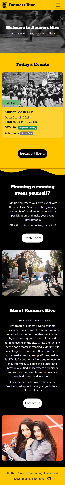
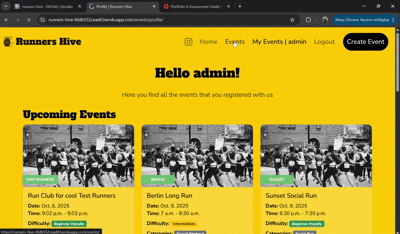
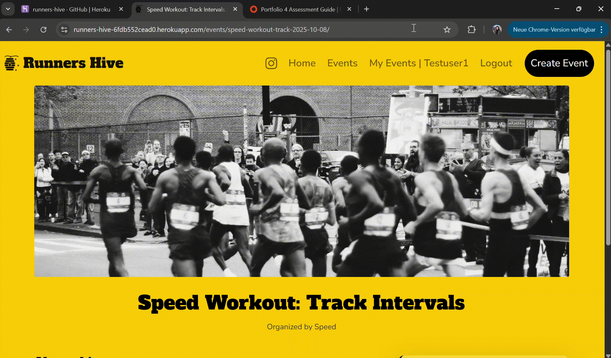
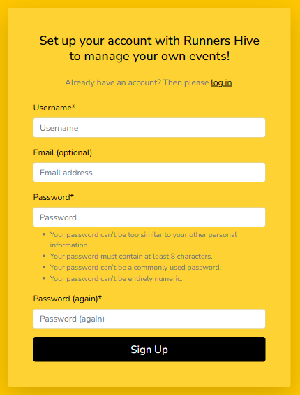
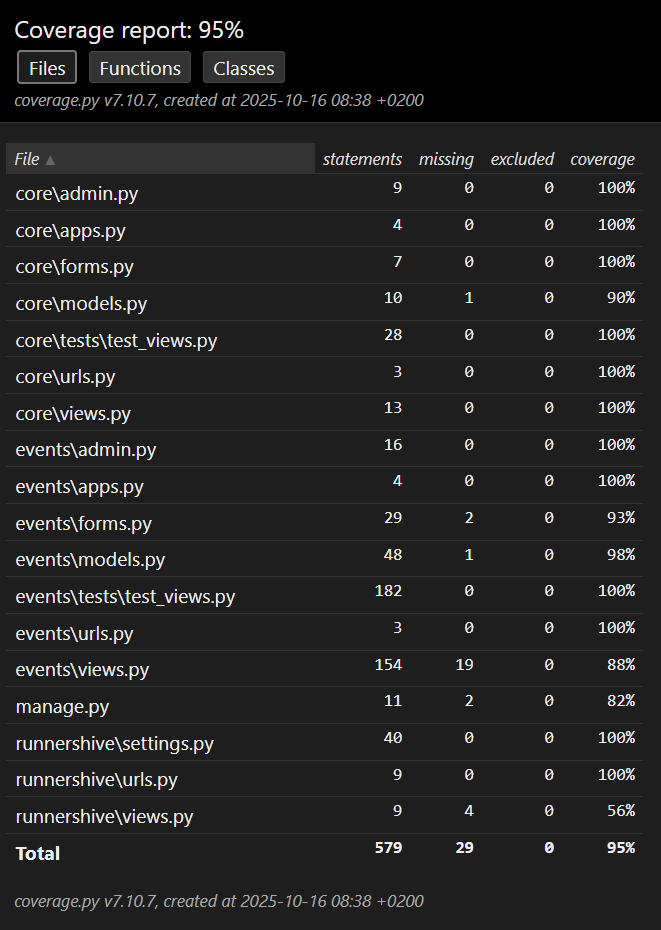

# Testing

> [!NOTE]  
> Return back to the [README.md](README.md) file.

## Code Validation

### HTML

I have used the recommended [HTML W3C Validator](https://validator.w3.org) to validate all of my HTML files.

When I validated the first full version of the website I got the following warning messages for all my html files. This is because the affected code was inside my base.html file, which cannot be validated seperately, but is part of all sites on the deployed website.

I documented how I solved the warning messages in [GitHub Issues](https://github.com/kathrinmzl/RunnersHive/issues/24). 
There I also tracked all remaining errors/warning messages. The links to the respective issue on GitHub can be found in the following table under "Initial result", if applicable.

The HTML files *"_event_card.html"* and *"_page_navigation.html"* were not seperately tested because they are called within the index, events-list and profile pages. I made sure to have enough events available in my dataset to trigger the pagination buttons, so that they would be present in the validated HTML code.

The final version of the website shows no further HTML Validation issues.

| Directory | File | URL | Final result | Initial result |
| --- | --- | --- | --- | --- |
| events/templates/events | [event_detail.html](https://github.com/kathrinmzl/RunnersHive/blob/main/events/templates/events/event_detail.html) |   | No Errors  | [Issue Link](https://github.com/kathrinmzl/RunnersHive/issues/26)   |
| events/templates/events | [event_form.html](https://github.com/kathrinmzl/RunnersHive/blob/main/events/templates/events/event_form.html) |   | Some HTML validation errors appear due to the way Summernote dynamically renders its editor (e.g., duplicate attributes, inline styles, or obsolete iframe attributes). These elements are generated by the library, not custom code, and do not affect functionality or accessibility. Since modifying Summernote’s internal HTML could break its behavior or updates, these minor validation warnings are acceptable to leave unresolved.  | - |
| events/templates/events | [event_list.html](https://github.com/kathrinmzl/RunnersHive/blob/main/events/templates/events/event_list.html) | [W3C Link](https://validator.w3.org/nu/?doc=https://runners-hive-6fdb552cead0.herokuapp.com/events/&out=html) | No Errors  | [Issue Link](https://github.com/kathrinmzl/RunnersHive/issues/25)  |
| events/templates/events | [profile.html](https://github.com/kathrinmzl/RunnersHive/blob/main/events/templates/events/profile.html) |   | No Errors  | - |
| runnershive/templates | [400.html](https://github.com/kathrinmzl/RunnersHive/blob/main/templates/400.html) |   | No Errors  | - |
| runnershive/templates | [403.html](https://github.com/kathrinmzl/RunnersHive/blob/main/templates/403.html) |   | No Errors  | - |
| runnershive/templates | [404.html](https://github.com/kathrinmzl/RunnersHive/blob/main/templates/404.html) |   | No Errors  | -  |
| runnershive/templates | [500.html](https://github.com/kathrinmzl/RunnersHive/blob/main/templates/500.html) |   | No Errors  | -  |
| runnershive/templates | [index.html](https://github.com/kathrinmzl/RunnersHive/blob/main/templates/index.html) | [W3C Link](https://validator.w3.org/nu/?doc=https://runners-hive-6fdb552cead0.herokuapp.com/&out=html) | No Errors  | - |
| runnershive/templates/account | [login.html](https://github.com/kathrinmzl/RunnersHive/blob/main/templates/account/login.html) | [W3C Link](https://validator.w3.org/nu/?doc=https://runners-hive-6fdb552cead0.herokuapp.com/accounts/login/&out=html) | No Errors  | - |
| runnershive/templates/account | [logout.html](https://github.com/kathrinmzl/RunnersHive/blob/main/templates/account/logout.html) |   | No Errors  | -  |
| runnershive/templates/account | [signup.html](https://github.com/kathrinmzl/RunnersHive/blob/main/templates/account/signup.html) |[W3C Link](https://validator.w3.org/nu/?doc=https%3A%2F%2Frunners-hive-6fdb552cead0.herokuapp.com%2Faccounts%2Fsignup%2F) | No Errors  | [Issue Link](https://github.com/kathrinmzl/RunnersHive/issues/27)  |

All other html files under *runnershive/templates/account* were created using `allauth` and have not been altered by me.

### CSS

I have used the recommended [CSS Jigsaw Validator](https://jigsaw.w3.org/css-validator) to validate all of my CSS files.

| Directory | File | URL | Screenshot | Notes |
| --- | --- | --- | --- | --- |
| static | [style.css](https://github.com/kathrinmzl/RunnersHive/blob/main/static/css/style.css) | [W3C Link](https://jigsaw.w3.org/css-validator/validator?uri=https://runners-hive-6fdb552cead0.herokuapp.com) |  | No Errors |

### JavaScript

I have used the recommended [JShint Validator](https://jshint.com) to validate all of my JS files.

| Directory | File | URL | Screenshot | Notes |
| --- | --- | --- | --- | --- |
| static | [profile.js](https://github.com/kathrinmzl/RunnersHive/blob/main/static/js/profile.js) |  |  | No Errors |
| static | [toasts.js](https://github.com/kathrinmzl/RunnersHive/blob/main/static/js/toasts.js) |  |  | Undefined variable 'Bootstrap' is acceptable because it's imported locally|
| static | [date_limit.js](https://github.com/kathrinmzl/RunnersHive/blob/main/static/js/date_limit.js) |  |  | No Errors |
| static | [toggle_filters.js](https://github.com/kathrinmzl/RunnersHive/blob/main/static/js/toggle_filters.js) |  |  | No Errors |

### Python

I have used the recommended [PEP8 CI Python Linter](https://pep8ci.herokuapp.com) to validate all of my Python files. Files that are unchanged from the Django template have been excluded from the validation as they are known to be valid.

| Directory | File | URL | Screenshot | Notes |
| --- | --- | --- | --- | --- |
| events | [admin.py](https://github.com/kathrinmzl/RunnersHive/blob/main/events/admin.py) | [PEP8 CI Link](https://pep8ci.herokuapp.com/https://raw.githubusercontent.com/kathrinmzl/RunnersHive/main/events/admin.py) |  | No Errors |
| events | [forms.py](https://github.com/kathrinmzl/RunnersHive/blob/main/events/forms.py) | [PEP8 CI Link](https://pep8ci.herokuapp.com/https://raw.githubusercontent.com/kathrinmzl/RunnersHive/main/events/forms.py) |  | No Errors |
| events | [models.py](https://github.com/kathrinmzl/RunnersHive/blob/main/events/models.py) | [PEP8 CI Link](https://pep8ci.herokuapp.com/https://raw.githubusercontent.com/kathrinmzl/RunnersHive/main/events/models.py) |  | No Errors |
| events | [test_views.py](https://github.com/kathrinmzl/RunnersHive/blob/main/events/tests/test_views.py) | [PEP8 CI Link](https://pep8ci.herokuapp.com/https://raw.githubusercontent.com/kathrinmzl/RunnersHive/main/events/tests/test_views.py) |  | No Errors |
| events | [urls.py](https://github.com/kathrinmzl/RunnersHive/blob/main/events/urls.py) | [PEP8 CI Link](https://pep8ci.herokuapp.com/https://raw.githubusercontent.com/kathrinmzl/RunnersHive/main/events/urls.py) |  | No Errors |
| events | [views.py](https://github.com/kathrinmzl/RunnersHive/blob/main/events/views.py) | [PEP8 CI Link](https://pep8ci.herokuapp.com/https://raw.githubusercontent.com/kathrinmzl/RunnersHive/main/events/views.py) |  | No Errors |
| runnershive | [settings.py](https://github.com/kathrinmzl/RunnersHive/blob/main/runnershive/settings.py) | [PEP8 CI Link](https://pep8ci.herokuapp.com/https://raw.githubusercontent.com/kathrinmzl/RunnersHive/main/runnershive/settings.py) |  | No Errors |
| runnershive | [urls.py](https://github.com/kathrinmzl/RunnersHive/blob/main/runnershive/urls.py) | [PEP8 CI Link](https://pep8ci.herokuapp.com/https://raw.githubusercontent.com/kathrinmzl/RunnersHive/main/runnershive/urls.py) |  | No Errors |
|  | [manage.py](https://github.com/kathrinmzl/RunnersHive/blob/main/manage.py) | [PEP8 CI Link](https://pep8ci.herokuapp.com/https://raw.githubusercontent.com/kathrinmzl/RunnersHive/main/manage.py) |  | No Errors |

## Responsiveness

I've tested my deployed project for responsiveness across screen sizes and found no issues.

I've only documented the 404 error page, as the other error pages use the same layout and only differ in the displayed text, so the test results are the same.

| Page | Mobile | Tablet | Desktop | Notes |
| --- | --- | --- | --- | --- |
| Homepage |  |  |  | Works as expected |
| Events |  |  |  | Works as expected |
| Event Details |  |  |  | Works as expected |
| Profile |  |  |  | Works as expected |
| Create Event |  |  |  | Works as expected |
| Login |  |  |  | Works as expected |
| Signup |  |  |  | Works as expected |
| Logout |  |  |  | Works as expected |
| Error pages 400, 403, 404, 500 (Example: 404) |  |  |  | Works as expected |

## Browser Compatibility

I've tested my deployed project on multiple browsers to check for compatibility and found no issues. The results for the Safari browser were created using [Lambdatest](https://www.lambdatest.com/). Chrome and Edge are both installed on my own device.

I've only documented the 404 error page, as the other error pages use the same layout and only differ in the displayed text, so the test results are the same.

| Page | Chrome | Edge | Safari | Notes |
| --- | --- | --- | --- | --- |
| Homepage |  |  |  | Works as expected |
| Events |  |  |  | Works as expected |
| Event Details |  |  |  | Works as expected |
| Profile |  |  |  | Works as expected |
| Create Event |  |  |  | Works as expected |
| Login |  |  |  | Works as expected |
| Signup |  |  |  | Works as expected |
| Logout |  |  |  | Works as expected |
| Error pages 400, 403, 404, 500 (Example: 404) |  |  | No screenshot available | Works as expected |

## Lighthouse Audit

I've tested my deployed project using the Lighthouse Audit tool to check for any major issues. Some warnings are outside of my control, and mobile results tend to be lower than desktop.

I've only documented the 404 error page, as the other error pages use the same layout and only differ in the displayed text, so the test results are the same.

| Page | Mobile | Desktop |
| --- | --- | --- |
| Homepage |  |  |
| Events |  |  |
| Event Details |  |  |
| Profile |  |  |
| Create Event |  |  |
| Login |  |  |
| Signup |  |  |
| Logout |  |  |
| Error pages 400, 403, 404, 500 (Example: 404) |  |  |

## Defensive Programming

Defensive programming was manually tested with the user acceptance criteria below, all of which have been successfully fulfilled.

| Page / Feature | Expectation | Test | Result | Screenshot |
| --- | --- | --- | --- | --- |
| Event Creation (Authenticated Users Only) | Only logged-in users can access the event creation form. | Tried to access `/events/create/` as a guest user. | Redirected to login page as expected. |  |
|  | Valid event form submissions should save successfully. | Created an event with valid input fields. | Event was successfully created and visible on events list. |  |
|  | Empty fields should be rejected. | Submitted form with empty fields. | Validation errors displayed. |  |
|  | Event date and/or start time cannot be in the past. | Tried to submit event that starts in the past. | Error message shown, submission blocked. |  |
|  | End time must be after start time. | Set start time later than end time. | Error message shown, submission blocked. |  |
|  | Character fields (title, organizer, location) should enforce maximum length. | Pasted excessively long string (e.g. 500+ chars) in character fields. | Trimmed input. |  |
|  | URL field should only accept valid URL's. | Pasted invalid URL. | Validation prevented submission, validation error displayed. |  |
| Event Editing | Users should only be able to edit *their own* events. | Logged in as User-A and accessed `/events/other-users-event/edit/` for User-B’s event. | Error message shown, redirect to profile page. |  |
|  | Event owner should be able to edit their event. | Updated event title and saved. | Changes reflected correctly. |  |
|  | Event owner should *not* be able to edit their event, if it's in the past. | Tried to access `/events/users-past-event/edit/`. | Info message shown, redirect to profile page. |  |
| Event Deletion | Only event owners should be able to delete their events. | Tried deleting another user’s event via brute URL. | Error message shown, redirect to profile page. |  |
|  | Event owner should be able to delete their event. | Deleted my event via confirm button. | Event removed from database and UI. |  |
| Event Cancel / Uncancel | Event owner should be able to cancel their event. | Clicked "Cancel" button. | Event marked as "Cancelled" in UI. |  |
|  | Event owner should be able to restore a cancelled event. | Clicked "Uncancel". | Event returned to "Active" status. |  |
|  | Only event owners should be able to cancel/uncancel their events. | Tried cancelling another user’s event via brute URL. |  Error message shown, redirect to profile page. |  |
|  | Event owner should *not* be able to cancel their event, if it's in the past. | Tried to access `/events/users-past-event/toggle_cancel/`. | Info message shown, redirect to profile page. |  |
| Authentication | Login should accept valid credentials and reject invalid ones. | Attempted login with wrong password. | Error message displayed. |  |
|  | Logout should remove access to restricted pages. | Logged out then accessed `/events/create/`. | Redirected to login. |  |
| URL Brute Force | Users should not access admin or restricted pages via URL. | Tried navigating to `/admin/` as standard user. | Access denied as expected. |  |
| 404 Error Page | Invalid URLs should show custom 404 page. | Navigated to `/nonexistent`. | Custom 404 page displayed. |  |

## User Story Testing

I've tested the must-have and should-have user stories to ensure they are correctly implemented, and all tests passed successfully.

| Nr | Target | Expectation | Outcome | Screenshot | Test Result |
| --- | --- | --- | --- | --- | --- |
| 1.1 | As a runner | I can see a list of upcoming events | so that I can find runs to join. |  | Pass |
| 1.2 | As a runner | I can filter events by date | so that I can quickly find ones that fit my schedule. |  | Pass |
| 1.3 | As a runner | I can filter events by category | so that I can find the type of event I prefer. |  | Pass |
| 1.4 | As a runner | I can filter events by difficulty | so that I can find the type of event I prefer. |  | Pass |
| 1.5 | As a runner | I can view details of a specific event | so that I can decide whether I want to participate. |  | Pass |
| 2.1 | As a logged-in user | I can not edit or delete another user’s events | so that data integrity is maintained. |  | Pass |
| 2.2 | As an organizer | I can create a new event | so that runners can find it. |  | Pass |
| 2.3 | As an organizer | I can edit my event | so that I can update details. |  | Pass |
| 2.4 | As an organizer | I can delete my event | so that I can remove it if I don't want to publish it anymore. |  | Pass |
| 2.5 | As an organizer | I cannot edit past events | so that historical data is preserved. |  | Pass |
| 2.6 | As an organizer | I can cancel my event | so that I can tell visitors that the event is not happening anymore. |  | Pass |
| 3.1 | As a logged-in user | I can view my profile page | so that I can see the events I’ve added. | Upcoming events:  Past events:  | Pass |
| 3.2 | As a logged-in user | I can update or delete my events from my profile | so that I can manage them easily. | Upcoming events:  Past events:  | Pass |
| 4.1 | As a new user | I can register for an account | so that I can add and manage my own events. | | Pass |
| 4.2 | As a user | I can log in and log out | so that I can access my profile and event management. | Login:   Logout: | Pass |
| 4.3 | As a visitor | I can use clear and simple navigation | so that I can find events, login, or register. |  | Pass |

## Automated Testing

I have conducted a series of automated tests on my application.

> [!NOTE]  
> I fully acknowledge and understand that, in a real-world scenario, an extensive set of additional tests would be more comprehensive.

### Python (Unit Testing)

I have used Django's built-in unit testing framework to test the application functionality. 

I created unit tests for the events app views which cover the applications main functionalities. All tests passed successfully:

In order to run the tests, I ran the following command in the terminal each time:

- `python3 manage.py test events`

To create the coverage report, I would then run the following commands:

- `pip3 install coverage`
- `pip3 freeze --local > requirements.txt`
- `coverage run --omit="*/site-packages/*,*/migrations/*,*/__init__.py,env.py,.env" manage.py test`
- `coverage report`

To see the HTML version of the reports, and find out whether some pieces of code were missing, I ran the following commands:

- `coverage html`
- `python3 -m http.server`

Below are the results from the full coverage report on my application that I've tested:

#### Unit Test Issues

While writing the unit tests I realized that I was only redirecting to the 404 page when trying to edit, cancel or delete other users events or when trying to edit or cancel past events. To provide better feedback to the user I changed this to redirect to the profile page and show an info or error toast message instead, telling the user what went wrong.

## Bugs

### Fixed Bugs

I've used [GitHub Issues](https://www.github.com/kathrinmzl/RunnersHive/issues) to track and manage major bugs and issues during the development and testing stages of my project.

All previously closed/fixed bugs can be tracked [here](https://www.github.com/kathrinmzl/RunnersHive/issues?q=is%3Aissue+is%3Aclosed+label%3Abug).

### Unfixed Bugs

To this date, no known unfixed errors remain in the application, though, even after thorough testing, I cannot rule out the possibility.

### Known Issues

| Issue | Screenshot |
| --- | --- |
| The project is designed to be responsive from `320px` and upwards, in line with the material taught on the course LMS. Minor layout inconsistencies may occur on extra-wide (e.g. 4k/8k monitors), or smart-display devices (e.g. Nest Hub, Smart Watches, Gameboy Color, etc.), as these resolutions are outside the project’s scope, as taught by Code Institute. |  |
| When validating the create event form, Some HTML validation errors appear due to the way Summernote dynamically renders its editor (e.g., duplicate attributes, inline styles, or obsolete iframe attributes). These elements are generated by the library, not custom code, and do not affect functionality or accessibility. Since modifying Summernote’s internal HTML could break its behavior or updates, these minor validation warnings are acceptable to leave unresolved.| |

> [!IMPORTANT]  
> There are no remaining bugs that I am aware of, though, even after thorough testing, I cannot rule out the possibility.
